<div align="center">

# Edge Deployer

**Write. Preview. Deploy. Observe. Roll back. All from one native desktop app.**

[](https://www.electronjs.org/)
[](https://react.dev/)
[](https://www.typescriptlang.org/)
[](#testing)
[](./LICENSE)
[](https://github.com/mansoormmamnoon/edge-deployer/actions)

A unified desktop IDE for serverless edge functions — write in Monaco, preview in an edge runtime, deploy to Cloudflare / AWS / Vercel / Netlify, then load-test, observe, scan for security issues, and export infrastructure-as-code. No tab switching. No terminal juggling. One window.

</div>

---

## Demo

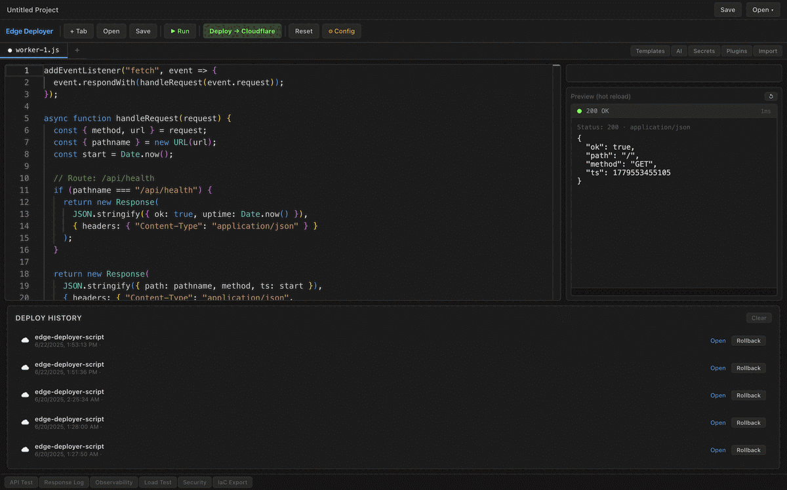

---

## Screenshots

**Phase 1 — Core**

| | |
|---|---|
| 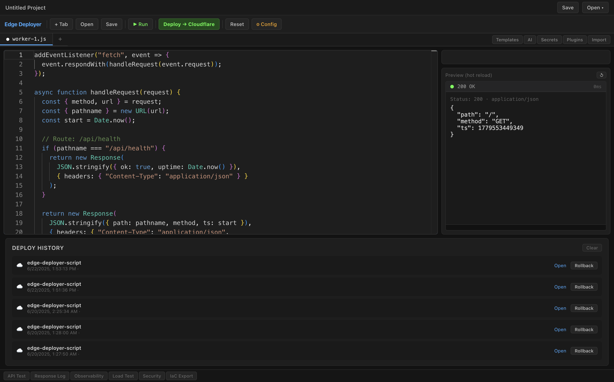 | 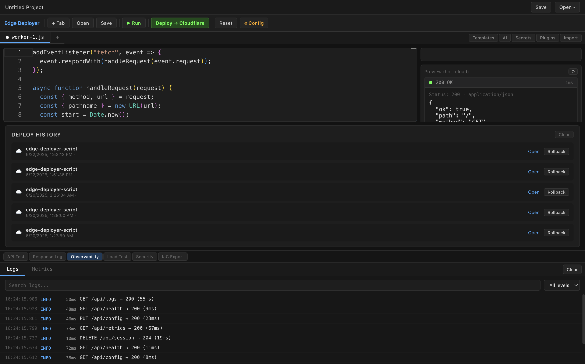 |
| *Monaco editor with hot-reload preview* | *Latency sparkline, P50/P95/P99* |
| 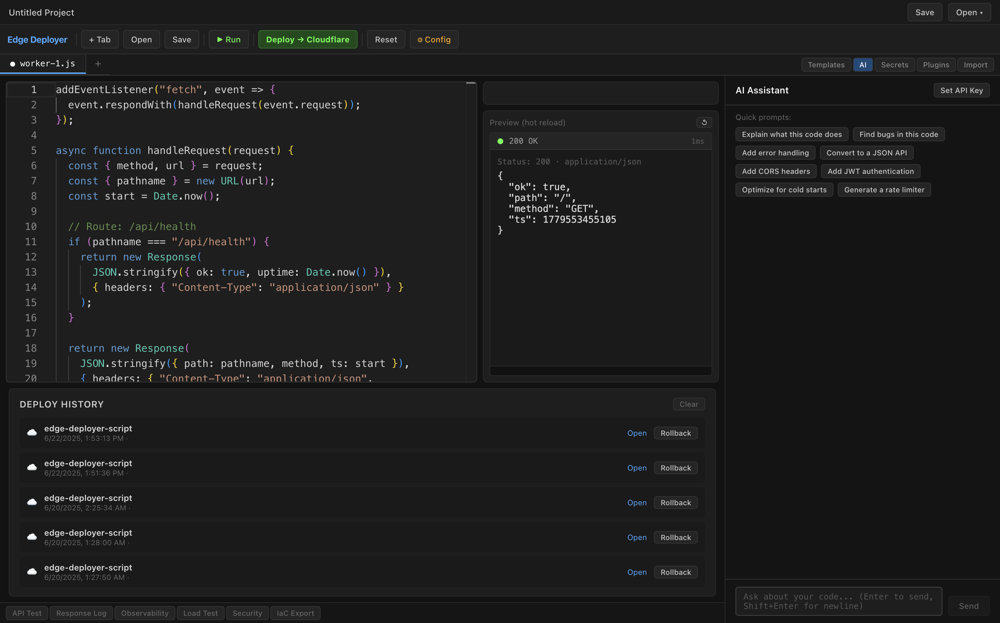 | 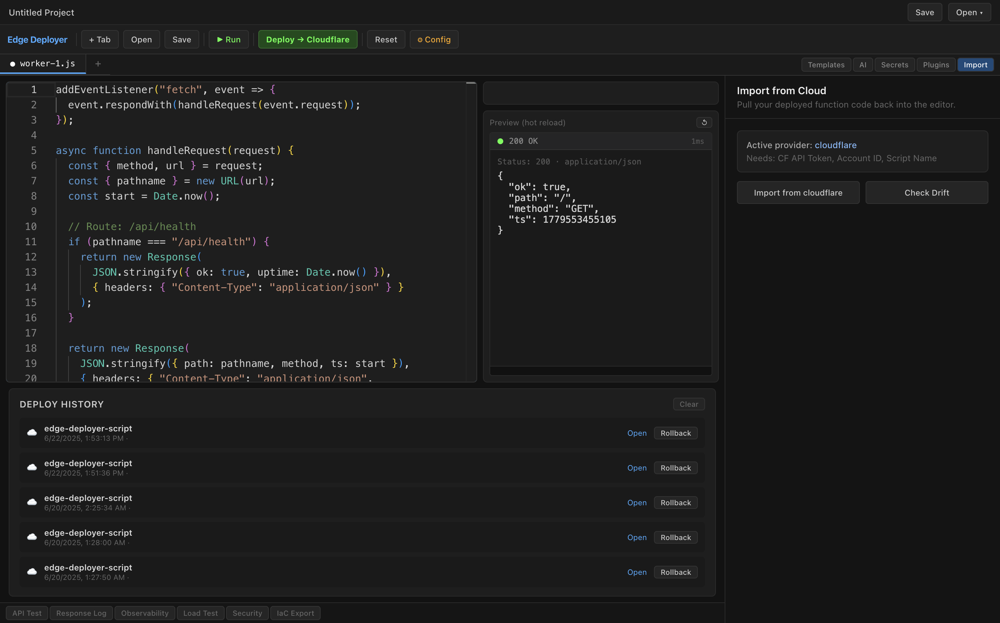 |
| *Claude-powered code assistant* | *Drift diff: local vs. deployed* |
| 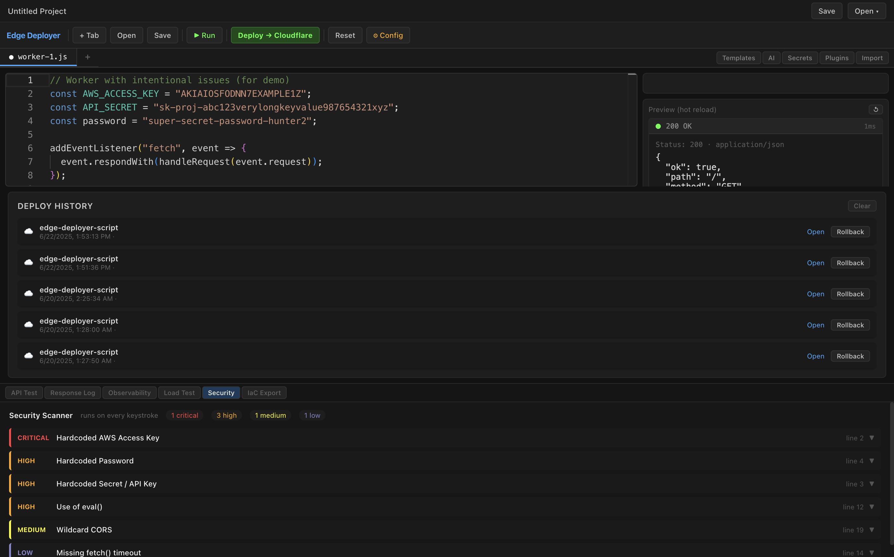 | 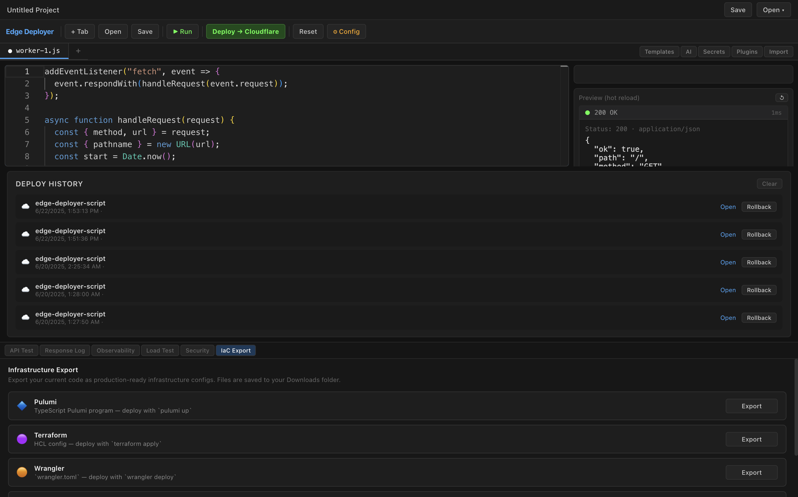 |
| *10-rule static analysis on every keystroke* | *Terraform HCL, Wrangler, Dockerfile+K8s* |

**Phase 2 — Ecosystem**

| | |
|---|---|
| 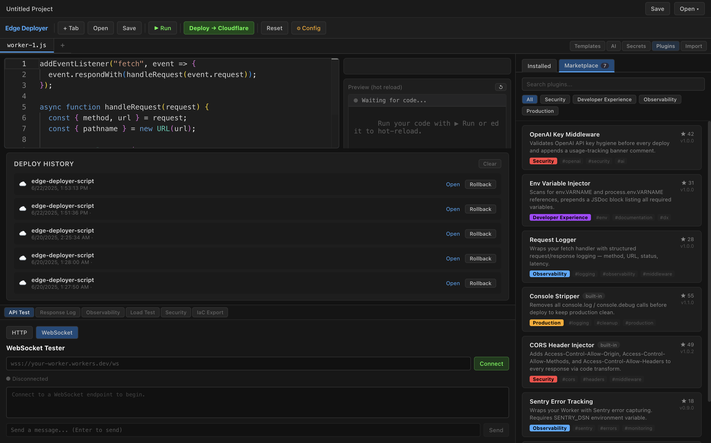 | 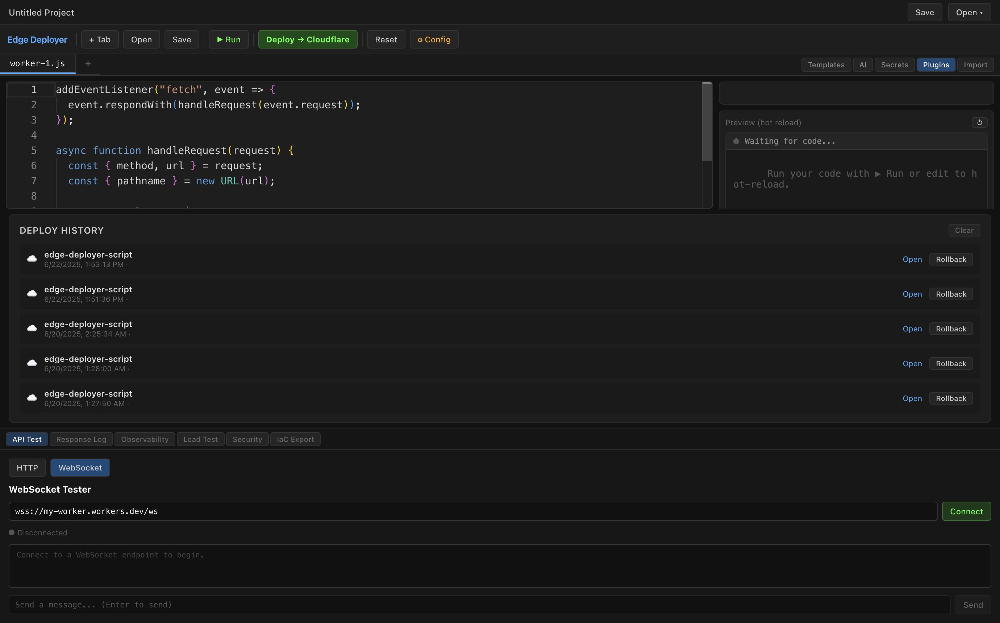 |
| *Plugin marketplace — browse, install, view permissions* | *WebSocket tester with live message log* |
| 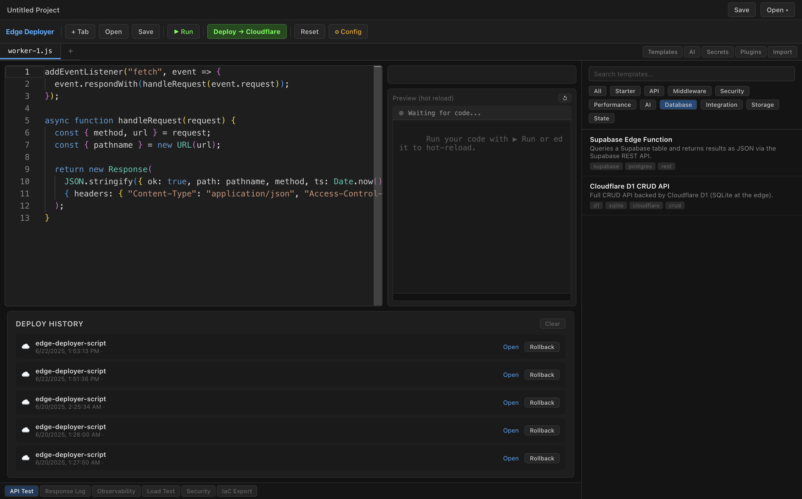 | 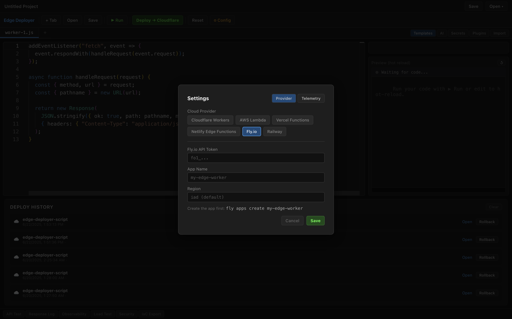 |
| *New Database templates: D1 CRUD, R2 Storage, Supabase* | *Fly.io deployer with app name and region config* |

**Phase 3 — Trust**

| |
|---|
| 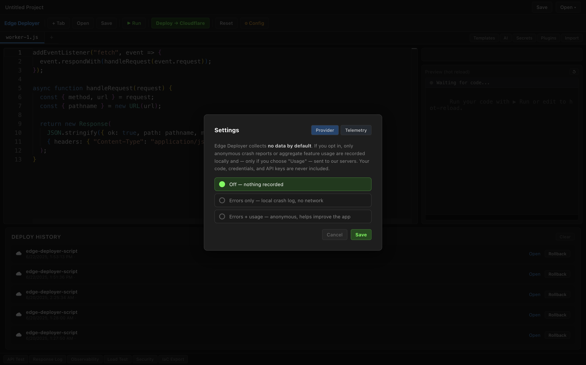 |
| *Privacy-first telemetry: off by default, three opt-in levels, no code/key data ever sent* |

> Screenshots captured from the live app. See [Releases](#releases) for binaries.

---

## Why I Built This

Serverless edge development was too fragmented: deploy from the terminal, watch logs in a browser dashboard, test in Postman, manage secrets in a separate CLI, generate infra in Terraform, ask questions in ChatGPT. Every context switch broke flow.

Edge Deployer started as an attempt to collapse the entire edge development loop into a single native window — editor, runtime, deploy engine, observability, AI, and infra generation all talking to each other without a server in the middle.

The result is an app where you can write a Worker, see it run in a simulated edge runtime, deploy it to a live Cloudflare URL, run a 100-RPS load test against it, export the Terraform config, and ask Claude to optimize the cold-start path — all without leaving the app.

---

## 60-Second Quickstart

1. **Download** the [latest release](#releases) for your OS
2. Open Edge Deployer — a "Hello World" worker loads automatically
3. Press `Cmd/Ctrl+Enter` to run the preview — see the response in the right pane
4. Click **⚙ Config** → select **Cloudflare Workers** → paste your API token, account ID, and a script name
5. Click **Deploy** — your worker is live at `https://your-script.your-account.workers.dev`
6. Open the **Load Test** panel → set 50 RPS → click Start
7. Open **AI** → ask "optimize this for cold starts"

No account required to use the editor, preview, or load tester. A cloud account is only needed for live deploys.

---

## What It Does

<details>
<summary><strong>Multi-Cloud Deploy Engine</strong> — Cloudflare, AWS Lambda, Vercel, Netlify</summary>

Every provider implements a shared 7-method `IDeployer` interface:

```
validate()    → credential pre-flight
build()       → artifact packaging
deploy()      → upload + return live URL
rollback()    → re-activate a previous version
logs()        → fetch structured entries
teardown()    → delete the function
healthcheck() → latency-aware ping
```

Adding a new provider is under 300 lines — implement the interface, register in the router.

| Provider | Deploy | Rollback | Import | Drift | Log Tail |
|---|---|---|---|---|---|
| Cloudflare Workers | ✅ | ✅ (Deployments API) | ✅ | ✅ | ✅ (live) |
| AWS Lambda | ✅ | ✅ (re-deploy) | ✅ (metadata) | ✅ | — |
| Vercel Functions | ✅ | ✅ (promote API) | ✅ | ✅ | — |
| Netlify Edge Functions | ✅ | ✅ (re-deploy) | — | — | — |
| Fly.io | ✅ (Machines API) | ✅ | — | — | ✅ (API) |
| Railway | ✅ (GraphQL API) | ✅ | — | — | ✅ (API) |

</details>

<details>
<summary><strong>Live Edge Runtime Simulator</strong> — no cloud account needed to preview</summary>

The preview iframe runs a full Cloudflare Workers runtime simulation:

- `addEventListener("fetch", event => ...)` with real `Request` / `Response` / `Headers`
- In-memory KV (`MY_KV.get / put / delete`)
- `console.log/warn/error` captured in a dedicated pane
- Hot reload — code changes trigger re-run automatically (debounced 400ms)
- 5-second timeout guard for infinite loops
- Content-aware rendering — HTML rendered, JSON pretty-printed, text shown raw

</details>

<details>
<summary><strong>AI Assistant</strong> — Claude API, key stays on your machine</summary>

- Chat with your current editor code injected as context on every message
- Quick prompts: explain, debug, add CORS, add auth, convert to JSON API, optimize for cold starts, generate rate limiter
- One-click code insertion into the active editor tab
- Error explainer — paste a runtime error, get a specific fix
- Worker generator — describe what you want, get complete Worker code
- API key stored in the encrypted vault; loaded automatically on next launch

</details>

<details>
<summary><strong>Observability Panel</strong> — structured logs, P50/P95/P99, sparkline</summary>

Every deploy log, rollback event, and API test result feeds the structured log stream:

```ts
{ id, timestamp, provider, level, message, latencyMs, status }
```

- Searchable log list, filterable by level
- Stat cards: total requests, error count, error rate, avg latency
- P50 / P95 / P99 latency percentiles
- SVG sparkline across the session

</details>

<details>
<summary><strong>Security Scanner</strong> — 10 rules, runs on every keystroke</summary>

Zero latency — pure regex on the code string, no server call:

| Rule | Severity |
|---|---|
| Hardcoded AWS Access Key | Critical |
| Hardcoded Bearer Token | Critical |
| Private Key in Source | Critical |
| GitHub Personal Access Token | Critical |
| Hardcoded Password | High |
| Hardcoded Secret / API Key | High |
| `eval()` usage | High |
| Wildcard CORS | Medium |
| `fetch()` without timeout | Low |
| `console.log` in production | Low |

Critical issues block deployment. Each finding shows line number, snippet, and a specific remediation message.

</details>

<details>
<summary><strong>Load Tester</strong> — P50/P95/P99 against any live URL</summary>

- Configure RPS (10 / 50 / 100+ preset or custom) and duration
- Live progress bar with real-time P50 estimate
- Final report: total requests, success/error counts, throughput, avg / P50 / P95 / P99
- Cold-start detection — flags requests that are statistical outliers

</details>

<details>
<summary><strong>IaC Export</strong> — Pulumi, Terraform, Wrangler, Dockerfile + K8s</summary>

| Format | Files | Command |
|---|---|---|
| Pulumi | `Pulumi.yaml` + `index.ts` | `pulumi up` |
| Terraform | `main.tf` + `variables.tf` + `worker.js` | `terraform apply` |
| Wrangler | `wrangler.toml` + `index.js` | `wrangler deploy` |
| Docker + K8s | `Dockerfile` + `kubernetes.yaml` + `index.js` | `docker build && kubectl apply` |

All configs include IAM roles, resource bindings, health probes, and resource limits.

</details>

<details>
<summary><strong>Encrypted Secrets Vault</strong> — AES-256-GCM, machine-keyed</summary>

- AES-256-GCM with PBKDF2 key derivation (100,000 iterations)
- Key is derived from the machine's hostname — zero user friction, no password to remember
- Vault is machine-local; a copy of the file on another machine will not decrypt
- Credentials are **never** written to `edge.json` workspace files
- Used by the AI assistant to load `ANTHROPIC_API_KEY` automatically

</details>

<details>
<summary><strong>Project Workspace</strong> — save, open, auto-save, recent projects</summary>

- `edge.json` workspace file — stores tabs, layout, config, deploy history
- Workspace bar shows project name, provider badge, and last-saved path
- Recent projects dropdown with provider badge and date
- Auto-saves every 30 seconds when a workspace is open
- `Cmd/Ctrl+S` saves the workspace (or file if no workspace is open)
- Credentials are excluded at the TypeScript type level — impossible to accidentally commit them

</details>

<details>
<summary><strong>Cloud Import + Drift Detection</strong></summary>

Pull your deployed code back into the editor without copy-pasting:

- **Cloudflare** — fetches the raw script body via the Workers API
- **Vercel** — downloads the latest production deployment's handler file
- **AWS** — retrieves function config and environment variable names

Drift detection does a line-by-line diff of your local editor code against the deployed version and shows a color-coded unified diff.

</details>

<details>
<summary><strong>Plugin System</strong> — sandboxed, permission-gated</summary>

Plugins run inside a `vm.Context` — no `require`, no filesystem, no network unless declared. Each plugin has an explicit permission manifest:

```json
{ "name": "my-plugin", "version": "1.0.0", "entrypoint": "index.js",
  "permissions": ["code:transform", "network:fetch"] }
```

Hooks: `onBeforeDeploy`, `onAfterDeploy`, `onCodeTransform`. 5-second execution timeout.

**Example plugins** in [`plugins/examples/`](./plugins/examples/):

| Plugin | What it does |
|---|---|
| `openai-middleware` | Validates OpenAI key hygiene, appends banner comment |
| `env-injector` | Scans for `env.VARNAME` refs and prepends a JSDoc block |
| `request-logger` | Injects structured request/response logging into the fetch handler |
| `console-stripper` *(built-in)* | Strips `console.log` before deploy |
| `cors-headers` *(built-in)* | Adds CORS headers via code transform |

See [docs/plugin-sdk.md](docs/plugin-sdk.md) for the full SDK reference.

</details>

---

## Performance

| Metric | Value |
|---|---|
| Preview hot reload latency | ~400ms (debounced) |
| Sandbox timeout guard | 5s |
| Secrets key derivation | PBKDF2, 100,000 iterations |
| Test suite | 85 tests, 6 suites |
| Deploy providers | 6 (Cloudflare, AWS, Vercel, Netlify, Fly.io, Railway) |
| Security scanner rules | 10 (4 critical, 2 high, 1 medium, 2 low) |
| Worker templates | 13 (8 core + 5 new: Supabase, Stripe, D1, R2, Durable Objects) |
| Marketplace plugins | 7 (3 installable + 2 built-in + 2 community preview) |
| IaC export formats | 4 (Pulumi, Terraform, Wrangler, Docker+K8s) |
| Telemetry levels | 3 (off / errors-local / anonymous-usage) |

---

## Releases

Pre-built binaries are published on every `v*` tag via the release CI workflow.

| Platform | Artifact | Notes |
|---|---|---|
| macOS | `.dmg` (Intel + Apple Silicon) | `x64` + `arm64` universal |
| Windows | `.exe` (NSIS installer) + portable | `x64` |
| Linux | `.AppImage` + `.deb` | `x64` |

**[→ Download latest release](https://github.com/mansoormmamnoon/edge-deployer/releases/latest)**

> First-time macOS users: right-click → Open to bypass Gatekeeper on unsigned builds.

---

## Privacy

Edge Deployer is a local-first app. Here is exactly what leaves your machine:

| Action | Data sent | Destination |
|---|---|---|
| Deploy | Your worker code + credentials | Your cloud provider only |
| AI assistant | Chat messages + current editor code | Anthropic API (only when you click Send) |
| Cloud import | API credentials | Your cloud provider only |
| Secrets vault | Nothing — encrypted file stays local | — |
| Load tester | HTTP requests | Your deployed URL only |

**No telemetry. No analytics. No crash reporting. No background network calls.**

Your API keys never touch any server we control. The AI assistant only sends requests when you explicitly ask it a question.

---

## Getting Started

### Install from source

```bash
git clone https://github.com/mansoormmamnoon/edge-deployer.git
cd edge-deployer
npm install
npm start        # dev mode: TypeScript watch + Webpack + Electron
```

### Build

```bash
npm run build              # compile + bundle
npm run package:mac        # .dmg for macOS
npm run package:win        # .exe for Windows
npm run package:linux      # .AppImage + .deb for Linux
```

### Prerequisites

- Node.js 18+
- npm 9+

---

## Provider Setup

<details>
<summary>Cloudflare Workers</summary>

1. Click **⚙ Config** → select **Cloudflare Workers**
2. **API Token** — `dash.cloudflare.com/profile/api-tokens` → Workers Scripts:Edit
3. **Account ID** — right sidebar on any Cloudflare dashboard page
4. **Script Name** — the slug your Worker will deploy under

Minimum token permissions: `Account > Workers Scripts > Edit`

</details>

<details>
<summary>AWS Lambda</summary>

1. Select **AWS Lambda** in Config
2. IAM minimum: `lambda:UpdateFunctionCode` + `lambda:GetFunction` + `iam:PassRole`
3. Fill in access key, secret key, region, and function name

</details>

<details>
<summary>Vercel</summary>

1. Select **Vercel Functions** in Config
2. Create a token at `vercel.com/account/tokens`
3. Fill in project ID (Project Settings → General) and optionally team ID

</details>

<details>
<summary>Netlify</summary>

1. Select **Netlify Edge Functions** in Config
2. Create a token at `app.netlify.com/user/applications`
3. Fill in site ID (Site Settings → General → Site ID)

</details>

<details>
<summary>Fly.io</summary>

1. Select **Fly.io** in Config
2. Create a token at `fly.io/user/personal_access_tokens`
3. Create your app first: `fly apps create my-edge-worker`
4. Fill in Token, App Name, and optionally Region (default: `iad`)

</details>

<details>
<summary>Railway</summary>

1. Select **Railway** in Config
2. Create a token at `railway.app/account/tokens`
3. Fill in Project ID (Project Settings → General), Service ID, and optionally Environment ID

</details>

See [docs/providers.md](docs/providers.md) for full setup details, required permissions, and import support.

---

## AI Assistant Setup

1. Open the **AI** side panel
2. Click **Set API Key** → paste your `sk-ant-...` Anthropic key
3. The key is saved to the encrypted vault as `ANTHROPIC_API_KEY`
4. Future sessions load it automatically

The assistant uses `claude-sonnet-4-6`. Your key is never sent anywhere except the Anthropic API, and only when you click Send.

---

## Keyboard Shortcuts

| Shortcut | Action |
|---|---|
| `Cmd/Ctrl + Enter` | Run preview |
| `Cmd/Ctrl + S` | Save workspace (or file) |
| `Cmd/Ctrl + O` | Open file |
| `Cmd/Ctrl + T` | New tab |

---

## Testing

```bash
npm test                  # run all tests
npm run test:coverage     # coverage report
```

**85 tests across 6 suites:**

| Suite | Tests | Coverage |
|---|---|---|
| `securityScanner.test.ts` | 22 | All 10 rules + edge cases |
| `loadTestStats.test.ts` | 19 | Percentile calc, cold-start detection |
| `cloudDeployers.test.ts` | 12 | IDeployer compliance, validate, build |
| `pluginSandbox.test.ts` | 16 | Manifest validation, sandbox execution, permission enforcement |
| `secretsVault.test.ts` | 7 | Encrypt/decrypt round-trip, wrong-key rejection |
| `workspace.test.ts` | 9 | Save/load, credential exclusion, version mismatch |

---

## CI/CD

Every push runs on GitHub Actions:

- **CI** — typecheck → `npm audit` → 85 tests with coverage → webpack build
- **Release** — matrix build (macOS/Windows/Linux) on `v*` tags → publishes to GitHub Releases

```bash
git tag v2.0.0 && git push origin v2.0.0   # triggers release build
```

---

## Architecture

```
┌──────────────────────────────────────────────────┐
│              Electron Main Process               │
│                                                  │
│  workspace.ts   cloudImporter.ts   secretsVault  │
│  multiCloud     pluginSandbox      aiAssistant   │
│  generateTerraform / Wrangler / Dockerfile       │
│                                                  │
│          ipcMain handlers (main.ts)              │
└────────────────────┬─────────────────────────────┘
                     │ contextBridge (preload.ts)
                     │ typed as ElectronAPI in types.ts
┌────────────────────▼─────────────────────────────┐
│              Renderer (React 19)                 │
│                                                  │
│  WorkspaceBar  TabBar  MonacoEditor  Toolbar     │
│  AIAssistant   ImportPanel  SecretsVault         │
│  ObservabilityPanel  LoadTestPanel  SecurityScanner│
│  InfraExport   TemplatesPanel  PluginPanel       │
│                                                  │
│  src/lib/securityScanner.ts  (pure, testable)    │
│  src/lib/loadTestStats.ts    (pure, testable)    │
└──────────────────────┬───────────────────────────┘
                       │ postMessage
┌──────────────────────▼───────────────────────────┐
│         Preview iframe (preview.html)            │
│  Edge runtime: fetch events, KV, console capture │
│  AbortSignal timeout guard, content rendering    │
└──────────────────────────────────────────────────┘
```

**Security rule:** the renderer never holds plaintext credentials. All tokens live in the encrypted vault in the main process and are never sent over IPC.

Full architecture reference: [docs/architecture.md](docs/architecture.md)

---

## Documentation

| Doc | Description |
|---|---|
| [docs/architecture.md](docs/architecture.md) | Process model, IPC surface, workspace model, plugin sandbox internals |
| [docs/providers.md](docs/providers.md) | Per-provider credentials, deploy mechanics, import support, known limits |
| [docs/security.md](docs/security.md) | Threat model, vault encryption spec, sandbox isolation, scanner details |
| [docs/plugin-sdk.md](docs/plugin-sdk.md) | Manifest format, hooks, permissions, sandbox environment, examples |
| [docs/code-signing.md](docs/code-signing.md) | macOS Developer ID + notarization, Windows Authenticode, CI secrets setup |
| [plugins/registry.json](plugins/registry.json) | Community plugin registry — 7 plugins with categories, permissions, install instructions |

---

## Known Limitations

- **AWS import** — returns function metadata and a placeholder handler; full ZIP unpack not implemented in-app
- **Netlify import** — not supported (no public source-download API)
- **Vault key strength** — derived from OS hostname; not hardened against an attacker with both filesystem access and the hostname
- **Security scanner** — regex-based; obfuscated secrets may evade detection
- **macOS code signing** — Gatekeeper prompt on unsigned builds; configure a Developer ID cert as described in [docs/code-signing.md](docs/code-signing.md)
- **Cloudflare log tail** — requires Workers Paid plan (Tail Workers feature); free plan gets an error on connect
- **No cloud sync** — project files and secrets are local only
- **Fly.io deployer** — wraps the Worker as a Node.js HTTP service; true Fly Edge (WASM) support is on the roadmap
- **Railway deployer** — uses the Railway GraphQL API v2; breaking API changes may require updates

---

## Roadmap

**Phase 1 — Core** ✅ Complete
- Multi-cloud deploy engine (Cloudflare, AWS, Vercel, Netlify)
- Live edge runtime sandbox with hot reload
- Multi-tab editor, templates marketplace (8 templates)
- AI assistant (Claude API), encrypted AES-256-GCM vault
- Load tester (P50/P95/P99), security scanner (10 rules)
- IaC export (Pulumi, Terraform, Wrangler, Docker+K8s)
- Deploy rollback + post-rollback healthcheck
- Plugin system (vm.Context sandbox, manifest validation, permissions)
- Workspace persistence (save/open/auto-save/recent), cloud import, drift detection
- 85-test suite, GitHub Actions CI/CD (typecheck → audit → test → build → release)
- Docs (architecture, providers, security, plugin-sdk, code-signing)

**Phase 2 — Ecosystem** ✅ Complete
- ✅ Real-time Cloudflare log tail (Tail Workers API, live WebSocket stream)
- ✅ WebSocket testing in API panel (connect, send, receive, log)
- ✅ More templates — Supabase, Stripe Webhook, Cloudflare D1, R2, Durable Objects (13 total)
- ✅ Fly.io and Railway deployers (6 providers total)
- ✅ Plugin marketplace UI (7 plugins — browse by category, view permissions, install instructions)
- ✅ Demo GIF + screenshots + full visual evidence

**Phase 3 — Trust** ✅ Complete
- ✅ Telemetry opt-in (3 levels: off / errors-only local / anonymous usage; no code or keys ever sent)
- ✅ macOS notarized + code-signed release workflow (CSC secrets, Apple notarization, Windows Authenticode)
- ✅ Code-signing documentation ([docs/code-signing.md](docs/code-signing.md))
- ✅ Community plugin registry ([plugins/registry.json](plugins/registry.json))

**Phase 4 — Future**
- [ ] Optional encrypted cloud backup / project sync
- [ ] Fly.io native Edge (WASM) runtime support
- [ ] Real-time collaborative editing
- [ ] VSCode extension for deploy-without-leaving-editor

---

<div align="center">

Built by [Mansoor Mamnoon](https://github.com/mansoormmamnoon) · ISC License · [Report an issue](https://github.com/mansoormmamnoon/edge-deployer/issues)

</div>
